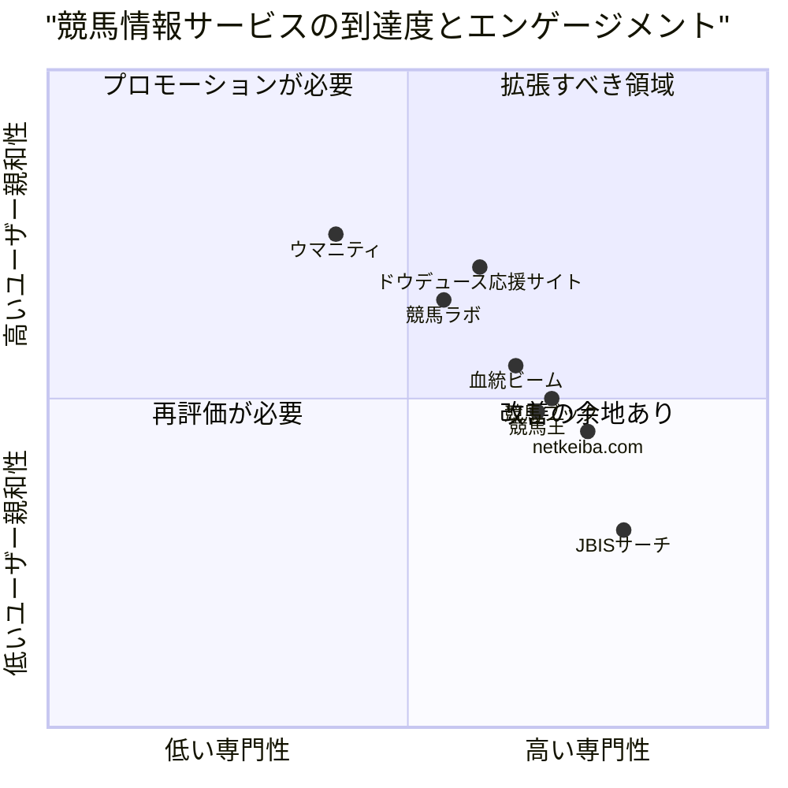

# ドウデュース応援サイト Phase1 - 要件定義書（PRD）

## 1. プロジェクト概要

### 1.1 プロジェクト名
**doduece_support_site**

### 1.2 プロジェクト目的
種牡馬「ドウデュース」の交配牝馬一覧をまとめたWeb応援サイトを構築し、ファンや関係者が年別に交配情報を閲覧できるプラットフォームを提供する。Phase1では基本的な情報表示と管理機能を実装し、将来的に産駒データベースや写真投稿、iOSアプリへと拡張する基盤を構築する。

### 1.3 元の要件
- 種牡馬ドウデュースの交配牝馬一覧を表示するWeb応援サイト
- Supabase/PostgreSQLを使用したデータベース構築
- 管理画面（CSVアップロード、認証機能）
- netkeibaからCSVを取得するPythonツール（ローカル用）

### 1.4 使用技術スタック

**プログラミング言語**: TypeScript, Python3

**フロントエンド**:
- Next.js (App Router)
- TypeScript
- Tailwind CSS
- Shadcn-ui

**バックエンドサービス**: 
- Supabase (PostgreSQL + Auth + Storage)

**ローカルツール**:
- Python3
- requests
- BeautifulSoup4

**デプロイ**:
- Vercel

## 2. プロダクト定義

### 2.1 プロダクトゴール

1. **情報の可視化**: 種牡馬ドウデュースの交配牝馬情報を年別に整理し、誰でも簡単にアクセスできる形で提供する
2. **効率的な管理**: 管理者がCSVアップロードにより簡単にデータを更新・管理できる仕組みを構築する
3. **将来の拡張性**: Phase2以降の産駒DB、写真投稿、iOSアプリへの拡張を見据えた柔軟なアーキテクチャを実現する

### 2.2 ユーザーストーリー

1. **一般ユーザーとして**、ドウデュースの交配牝馬一覧を年別に閲覧したい。そうすることで、どの牝馬と交配したかを把握し、将来の産駒に期待できる。

2. **競馬ファンとして**、交配牝馬の詳細情報（父馬、賞金、勝鞍クラス、代表産駒など）をフィルタ・ソートして確認したい。そうすることで、血統や実績から産駒の可能性を予測できる。

3. **管理者として**、netkeibaから取得したCSVデータを簡単にアップロードして、サイトの情報を最新に保ちたい。そうすることで、手作業でのデータ入力を避け、効率的に運営できる。

4. **データ収集担当者として**、netkeibaの交配牝馬一覧ページから自動的にCSVを生成するツールを使いたい。そうすることで、手動でのコピー&ペーストを避け、正確なデータを短時間で取得できる。

5. **スマートフォンユーザーとして**、外出先でも交配牝馬情報をカード形式で見やすく閲覧したい。そうすることで、いつでもどこでも情報にアクセスできる。

### 2.3 競合分析

| 競合サービス | 長所 | 短所 |
|------------|------|------|
| **netkeiba.com** | 競馬情報の網羅性が高い、データベースが充実、リアルタイム更新 | 種牡馬特化の応援機能がない、UIが複雑、モバイル対応が不十分 |
| **JBISサーチ** | 公式データで信頼性が高い、血統情報が詳細、無料で利用可能 | 検索が複雑、ユーザーフレンドリーでない、応援要素がない |
| **競馬ラボ** | 予想機能が充実、コミュニティ機能あり、分析ツールが豊富 | 種牡馬情報は二次的、交配情報の更新が遅い、広告が多い |
| **ウマニティ** | SNS的な交流機能、写真投稿可能、ファンコミュニティが活発 | 交配情報の体系的整理が弱い、データベース機能が不足 |
| **競馬ブック** | 専門的な分析記事、プロの見解、詳細なレース情報 | 種牡馬特化ではない、有料コンテンツが多い、初心者に難しい |
| **血統ビーム** | 血統分析に特化、視覚的にわかりやすい、予想に役立つ | 交配牝馬一覧の管理機能なし、種牡馬応援要素がない |
| **競馬王** | 雑誌連動で信頼性高い、専門家の分析、レース予想が充実 | 種牡馬情報は限定的、リアルタイム性に欠ける、購読料が必要 |

### 2.4 競合分析四象限図



## 3. 技術仕様

### 3.1 要件分析

本プロジェクトは、種牡馬特化型の応援サイトという新しいアプローチを採用し、以下の技術的課題に対応する必要がある：

1. **データ管理の効率化**: 外部サイト（netkeiba）からのデータ取得を自動化し、管理者の負担を軽減
2. **レスポンシブデザイン**: PC・スマートフォン両対応で、デバイスに応じた最適な表示を実現
3. **拡張性の確保**: Phase2以降の機能追加を見据えたデータベース設計とアーキテクチャ
4. **セキュリティ**: 管理機能への適切なアクセス制御
5. **パフォーマンス**: 大量のデータを扱う際の表示速度の最適化

### 3.2 要件プール

#### P0（必須要件）

| ID | 要件 | 説明 |
|----|------|------|
| P0-1 | トップページ実装 | ドウデュース紹介と交配牝馬一覧へのナビゲーション |
| P0-2 | 交配牝馬一覧ページ | 年別の交配牝馬情報をテーブル形式で表示 |
| P0-3 | レスポンシブ対応 | PC版はテーブル、スマホ版はカード形式で表示 |
| P0-4 | データベース構築 | Supabaseでmares、cover_recordsテーブルを作成 |
| P0-5 | 管理者認証 | Supabase Authを使用したログイン機能 |
| P0-6 | CSVアップロード機能 | 管理画面からCSVをアップロードしてDB更新 |
| P0-7 | Pythonスクレイピングツール | netkeibaから交配牝馬データを取得しCSV生成 |
| P0-8 | UPSERT処理 | 既存データの更新と新規データの挿入を適切に処理 |

#### P1（推奨要件）

| ID | 要件 | 説明 |
|----|------|------|
| P1-1 | フィルタ機能 | 牝馬名、父馬名、賞金などで絞り込み |
| P1-2 | ソート機能 | 各カラムで昇順・降順ソート |
| P1-3 | 管理用一覧ページ | 登録済牝馬の確認と編集 |
| P1-4 | エラーハンドリング | CSVアップロード時のバリデーションとエラー表示 |
| P1-5 | ページネーション対応 | スクレイピングツールで複数ページを処理 |
| P1-6 | ローディング表示 | データ取得中のユーザーフィードバック |

#### P2（オプション要件）

| ID | 要件 | 説明 |
|----|------|------|
| P2-1 | 年選択UI改善 | ドロップダウンやタブでの年切り替え |
| P2-2 | データエクスポート | 管理画面からCSVダウンロード |
| P2-3 | 検索機能 | 牝馬名での部分一致検索 |
| P2-4 | アクセスログ | 管理画面でのアクセス履歴確認 |
| P2-5 | スクレイピング進捗表示 | Pythonツールでの処理状況表示 |

### 3.3 UI設計ドラフト

#### 3.3.1 トップページ (/)

```
+--------------------------------------------------+
|  [ロゴ] ドウデュース応援サイト          [管理]  |
+--------------------------------------------------+
|                                                  |
|  [ドウデュース画像エリア]                        |
|                                                  |
|  種牡馬ドウデュースの交配情報をまとめた          |
|  ファンサイトです。                              |
|                                                  |
|  [交配牝馬一覧を見る（2025年）] ボタン           |
|                                                  |
|  --- 将来追加予定の機能 ---                      |
|  ・産駒データベース                              |
|  ・写真投稿・掲示板                              |
|  ・iOSアプリ                                     |
|                                                  |
+--------------------------------------------------+
```

#### 3.3.2 交配牝馬一覧ページ - PC版 (/mares/[year])

```
+------------------------------------------------------------------+
|  ドウデュース応援サイト > 交配牝馬一覧（2025年）        [管理]  |
+------------------------------------------------------------------+
|  年選択: [2023] [2024] [2025▼]                                   |
|                                                                  |
|  フィルタ: [牝馬名___] [父馬名___]  ソート: [種付け日▼]         |
+------------------------------------------------------------------+
| 牝馬名 | 生年 | 父 | 種付け日 | 生産予定日 | 賞金 | 勝鞍 | 産駒 | 代表産駒 |
|--------|------|-----|---------|-----------|------|------|------|---------|
| アール | 2018 | キン| 2025/03 | 2026/02   | 8197 | 3勝  | 1頭  | ステラ  |
| ドヴィ |      | グカ| /12     | /12       | 万円 | クラ |      | ヴェロ  |
| ーヴル |      | メハ|         |           |      | ス   |      | ーチェ  |
| (Link) |      | メハ|         |           |      |      |      | (Link)  |
|--------|------|-----|---------|-----------|------|------|------|---------|
| ...    | ...  | ... | ...     | ...       | ...  | ...  | ...  | ...     |
+------------------------------------------------------------------+
```

#### 3.3.3 交配牝馬一覧ページ - スマホ版 (/mares/[year])

```
+--------------------------------+
| ドウデュース応援サイト    [≡] |
+--------------------------------+
| 交配牝馬一覧（2025年）         |
|                                |
| 年: [2025▼]  ソート: [日付▼]  |
+--------------------------------+
| +----------------------------+ |
| | アールドヴィーヴル (Link)  | |
| | 父: キングカメハメハ       | |
| | 生年: 2018                 | |
| |                            | |
| | 種付け: 2025/03/12         | |
| | 生産予定: 2026/02/12       | |
| |                            | |
| | 獲得賞金: 8197万円         | |
| | 勝鞍: 3勝クラス            | |
| | 産駒: 1頭                  | |
| | 代表: ステラヴェローチェ   | |
| +----------------------------+ |
|                                |
| +----------------------------+ |
| | [次の牝馬カード]           | |
| +----------------------------+ |
+--------------------------------+
```

#### 3.3.4 管理画面 - ログイン (/admin/login)

```
+----------------------------------+
|  ドウデュース応援サイト 管理画面 |
+----------------------------------+
|                                  |
|  [ログイン]                      |
|                                  |
|  メールアドレス:                 |
|  [________________]              |
|                                  |
|  パスワード:                     |
|  [________________]              |
|                                  |
|  [ログイン] ボタン               |
|                                  |
+----------------------------------+
```

#### 3.3.5 管理画面 - CSVアップロード (/admin/import)

```
+--------------------------------------------------+
|  管理画面 > CSVアップロード              [ログアウト] |
+--------------------------------------------------+
|                                                  |
|  CSVファイルを選択してアップロードしてください   |
|                                                  |
|  [ファイルを選択] [選択されていません]           |
|                                                  |
|  [アップロード] ボタン                           |
|                                                  |
|  --- アップロード履歴 ---                        |
|  2025/01/15 10:30 - mares_2025.csv (50件)       |
|  2024/12/20 14:20 - mares_2024.csv (45件)       |
|                                                  |
+--------------------------------------------------+
```

### 3.4 データベース仕様

#### 3.4.1 テーブル定義

##### (A) mares（牝馬マスタ）

| カラム名 | データ型 | 制約 | 説明 |
|---------|---------|------|------|
| id | uuid | PRIMARY KEY | 牝馬ID（自動生成） |
| netkeiba_id | text | UNIQUE | netkeibaの牝馬ID（例: 000a01d5a9） |
| name | text | NOT NULL | 牝馬名 |
| birth_year | int | | 生年 |
| sire_name | text | | 父馬名 |
| netkeiba_url | text | | netkeibaの牝馬ページURL |
| total_prize | int | | 獲得賞金（万円） |
| best_win_class | text | | 最高勝鞍クラス（G1、重賞、3勝クラスなど） |
| created_at | timestamptz | DEFAULT now() | 作成日時 |

**インデックス**:
- `netkeiba_id` (UNIQUE)
- `name` (検索用)

**SQL**:
```sql
CREATE TABLE mares (
  id uuid PRIMARY KEY DEFAULT gen_random_uuid(),
  netkeiba_id text UNIQUE,
  name text NOT NULL,
  birth_year int,
  sire_name text,
  netkeiba_url text,
  total_prize int,
  best_win_class text,
  created_at timestamptz DEFAULT now()
);

CREATE INDEX idx_mares_netkeiba_id ON mares(netkeiba_id);
CREATE INDEX idx_mares_name ON mares(name);
```

##### (B) cover_records（交配記録）

| カラム名 | データ型 | 制約 | 説明 |
|---------|---------|------|------|
| id | uuid | PRIMARY KEY | 交配記録ID（自動生成） |
| stallion_name | text | NOT NULL | 種牡馬名（Phase1では"ドウデュース"固定） |
| mare_id | uuid | FOREIGN KEY | 牝馬ID（mares.idへの参照） |
| season_year | int | NOT NULL | 交配年 |
| cover_date | date | | 種付け日 |
| expected_foaling_date | date | | 生産予定日（種付け日 + 11ヶ月） |
| offsprings_started | int | | 既出走産駒頭数 |
| representative_offspring_name | text | | 代表産駒名 |
| representative_offspring_url | text | | 代表産駒のnetkeibaURL |
| created_at | timestamptz | DEFAULT now() | 作成日時 |

**インデックス**:
- `mare_id` (外部キー)
- `season_year` (年別検索用)
- `(season_year, mare_id)` (UNIQUE、重複防止)

**SQL**:
```sql
CREATE TABLE cover_records (
  id uuid PRIMARY KEY DEFAULT gen_random_uuid(),
  stallion_name text NOT NULL DEFAULT 'ドウデュース',
  mare_id uuid REFERENCES mares(id) ON DELETE CASCADE,
  season_year int NOT NULL,
  cover_date date,
  expected_foaling_date date,
  offsprings_started int,
  representative_offspring_name text,
  representative_offspring_url text,
  created_at timestamptz DEFAULT now(),
  UNIQUE(season_year, mare_id)
);

CREATE INDEX idx_cover_records_mare_id ON cover_records(mare_id);
CREATE INDEX idx_cover_records_season_year ON cover_records(season_year);
```

#### 3.4.2 将来拡張用テーブル（Phase2以降）

以下のテーブルは今回は作成しないが、将来の拡張を見据えて設計を記載：

- **foals（産駒）**: 産駒の詳細情報
- **race_events（レース出走情報）**: 産駒のレース出走履歴
- **users（ユーザー）**: 会員登録機能用
- **user_devices（デバイス情報）**: プッシュ通知用
- **user_subscriptions（購読情報）**: お気に入り馬のフォロー用
- **photos（写真）**: 写真投稿機能用
- **board_posts（掲示板投稿）**: 掲示板機能用

### 3.5 CSVフォーマット仕様

#### 3.5.1 Phase1 CSVフォーマット

**ファイル名**: `mares_YYYY.csv`（例: mares_2025.csv）

**エンコーディング**: UTF-8

**ヘッダー行**:
```
season_year,netkeiba_id,mare_name,mare_birth_year,mare_sire_name,cover_date,expected_foaling_date,total_prize,best_win_class,offsprings_started,representative_offspring_name,representative_offspring_url,mare_netkeiba_url
```

**データ例**:
```csv
season_year,netkeiba_id,mare_name,mare_birth_year,mare_sire_name,cover_date,expected_foaling_date,total_prize,best_win_class,offsprings_started,representative_offspring_name,representative_offspring_url,mare_netkeiba_url
2025,000a01d5a9,アールドヴィーヴル,2018,キングカメハメハ,2025-03-12,2026-02-12,8197,3勝クラス,1,ステラヴェローチェ,https://db.netkeiba.com/horse/2022105678,https://db.netkeiba.com/horse/000a01d5a9
2025,000b02e6b0,サンプル牝馬,2019,ディープインパクト,2025-02-20,2026-01-20,15000,G1,3,サンプル産駒,https://db.netkeiba.com/horse/2021106789,https://db.netkeiba.com/horse/000b02e6b0
```

#### 3.5.2 フィールド仕様

| フィールド名 | データ型 | 必須 | 説明 | 例 |
|-------------|---------|------|------|-----|
| season_year | int | ○ | 交配年 | 2025 |
| netkeiba_id | text | ○ | netkeibaの牝馬ID | 000a01d5a9 |
| mare_name | text | ○ | 牝馬名 | アールドヴィーヴル |
| mare_birth_year | int | | 牝馬の生年 | 2018 |
| mare_sire_name | text | | 牝馬の父馬名 | キングカメハメハ |
| cover_date | date | | 種付け日（YYYY-MM-DD） | 2025-03-12 |
| expected_foaling_date | date | | 生産予定日（YYYY-MM-DD） | 2026-02-12 |
| total_prize | int | | 獲得賞金（万円単位） | 8197 |
| best_win_class | text | | 最高勝鞍クラス | 3勝クラス |
| offsprings_started | int | | 既出走産駒頭数 | 1 |
| representative_offspring_name | text | | 代表産駒名 | ステラヴェローチェ |
| representative_offspring_url | text | | 代表産駒URL | https://db.netkeiba.com/horse/... |
| mare_netkeiba_url | text | | 牝馬URL | https://db.netkeiba.com/horse/... |

#### 3.5.3 バリデーションルール

1. **season_year**: 1900〜2100の範囲内
2. **netkeiba_id**: 10文字の英数字
3. **mare_name**: 空白不可
4. **cover_date**: YYYY-MM-DD形式、未来日付も許可
5. **expected_foaling_date**: cover_dateより後の日付
6. **total_prize**: 0以上の整数
7. **offsprings_started**: 0以上の整数
8. **URL**: http/httpsで始まる有効なURL形式

### 3.6 Pythonスクレイピングツール仕様

#### 3.6.1 ツール概要

**ツール名**: `netkeiba_mating_csv_generator.py`

**目的**: netkeibaの種牡馬交配牝馬一覧ページから、Phase1のCSV形式に準拠したデータを自動取得

**実行環境**: ローカルPC（手動実行）

#### 3.6.2 コマンドライン引数

```bash
# 種牡馬IDと年を指定
python netkeiba_mating_csv_generator.py \
  --stallion-id 2019105283 \
  --year 2025 \
  --output mares_2025.csv

# URLを直接指定
python netkeiba_mating_csv_generator.py \
  --url "https://own.netkeiba.com/db/sire_broodmare.html?id=2019105283&year=2025" \
  --output mares_2025.csv
```

**引数仕様**:
- `--stallion-id`: 種牡馬ID（必須、URLと排他）
- `--year`: 交配年（stallion-id使用時は必須）
- `--url`: 直接URL指定（必須、stallion-idと排他）
- `--output`: 出力CSVファイル名（必須）
- `--sleep`: リクエスト間のスリープ秒数（デフォルト: 3秒）
- `--encoding`: HTMLエンコーディング（デフォルト: euc-jp）

#### 3.6.3 処理フロー

1. **引数解析**: コマンドライン引数をパース
2. **URL生成**: stallion-idとyearからURLを構築（URL直接指定の場合はスキップ）
3. **ページ取得**: requestsでHTMLを取得
4. **エンコーディング処理**: 適切な文字コードでデコード
5. **HTML解析**: BeautifulSoup4でテーブルをパース
6. **データ抽出**: 各行から必要な項目を抽出
7. **日付計算**: 種付け日から生産予定日を計算（+11ヶ月）
8. **ページネーション**: 次ページがあれば繰り返し（3〜5秒スリープ）
9. **CSV出力**: UTF-8でCSVファイルに書き込み

#### 3.6.4 抽出ロジック

**対象ページ**: `https://own.netkeiba.com/db/sire_broodmare.html?id={stallion_id}&year={year}`

**抽出項目とXPath/セレクタ**:

| 項目 | 抽出方法 |
|------|---------|
| netkeiba_id | 牝馬リンクのURLから正規表現で抽出 `/horse/([a-z0-9]+)` |
| mare_name | テーブル1列目のテキスト |
| mare_birth_year | テーブル2列目のテキスト |
| mare_sire_name | テーブル3列目のテキスト |
| cover_date | テーブル4列目のテキスト（YYYY/MM/DD → YYYY-MM-DD変換） |
| total_prize | テーブル5列目のテキスト（カンマ除去、数値変換） |
| best_win_class | テーブル6列目のテキスト |
| offsprings_started | テーブル7列目のテキスト（数値変換） |
| representative_offspring_name | テーブル8列目のテキスト |
| representative_offspring_url | テーブル8列目のリンクURL |
| mare_netkeiba_url | テーブル1列目のリンクURL |
| expected_foaling_date | cover_dateに11ヶ月加算（dateutil使用） |

#### 3.6.5 エラーハンドリング

1. **ネットワークエラー**: リトライ3回、失敗時はエラーメッセージ表示して終了
2. **HTMLパース失敗**: 該当行をスキップし、警告ログ出力
3. **データ欠損**: 空文字列またはNoneで埋める
4. **日付計算エラー**: expected_foaling_dateを空にして続行
5. **ページネーション失敗**: 現在までのデータでCSV出力

#### 3.6.6 出力仕様

- **ファイル形式**: CSV（UTF-8 BOM無し）
- **改行コード**: LF（\n）
- **クォート**: 必要な場合のみダブルクォート
- **ヘッダー**: 必ず1行目に出力

### 3.7 ルーティング構成

#### 3.7.1 一般ユーザー向けページ

| パス | 説明 | 認証 |
|------|------|------|
| `/` | トップページ | 不要 |
| `/mares/2023` | 2023年交配牝馬一覧 | 不要 |
| `/mares/2024` | 2024年交配牝馬一覧 | 不要 |
| `/mares/2025` | 2025年交配牝馬一覧 | 不要 |
| `/mares/[year]` | 動的年別一覧（将来対応） | 不要 |

#### 3.7.2 管理者向けページ

| パス | 説明 | 認証 |
|------|------|------|
| `/admin/login` | 管理者ログイン | 不要 |
| `/admin/import` | CSVアップロード | 必要 |
| `/admin/mares` | 管理用牝馬一覧 | 必要 |

### 3.8 API仕様

#### 3.8.1 Supabase API使用

Supabase Clientを使用した直接的なDB操作を行う。REST APIは使用しない。

**主要操作**:

1. **交配牝馬一覧取得**
```typescript
const { data, error } = await supabase
  .from('cover_records')
  .select(`
    *,
    mares (
      id,
      netkeiba_id,
      name,
      birth_year,
      sire_name,
      netkeiba_url,
      total_prize,
      best_win_class
    )
  `)
  .eq('season_year', year)
  .order('cover_date', { ascending: false });
```

2. **CSVデータのUPSERT（牝馬）**
```typescript
const { data, error } = await supabase
  .from('mares')
  .upsert(
    { netkeiba_id, name, birth_year, sire_name, netkeiba_url, total_prize, best_win_class },
    { onConflict: 'netkeiba_id' }
  )
  .select();
```

3. **CSVデータのUPSERT（交配記録）**
```typescript
const { data, error } = await supabase
  .from('cover_records')
  .upsert(
    {
      stallion_name: 'ドウデュース',
      mare_id,
      season_year,
      cover_date,
      expected_foaling_date,
      offsprings_started,
      representative_offspring_name,
      representative_offspring_url
    },
    { onConflict: 'season_year,mare_id' }
  )
  .select();
```

#### 3.8.2 認証フロー

**Supabase Auth使用**:

1. **ログイン**
```typescript
const { data, error } = await supabase.auth.signInWithPassword({
  email: email,
  password: password,
});
```

2. **セッション確認**
```typescript
const { data: { session } } = await supabase.auth.getSession();
```

3. **ログアウト**
```typescript
const { error } = await supabase.auth.signOut();
```

### 3.9 未解決の課題

1. **netkeibaのHTML構造変更**: スクレイピング対象ページの構造が変更された場合の対応方法
   - 定期的な動作確認が必要
   - エラー検知の仕組みを検討

2. **大量データのパフォーマンス**: 交配牝馬が100頭を超えた場合の表示速度
   - ページネーションの導入を検討
   - 仮想スクロールの採用を検討

3. **CSVアップロードのバリデーション**: どこまで厳密にチェックするか
   - 必須項目のみチェックか、全項目の形式チェックまで行うか
   - エラー時の部分的な取り込み可否

4. **スマホ版のフィルタUI**: カード形式でのフィルタ・ソート操作の使いやすさ
   - モーダル表示か、ドロワー表示か
   - 適用後の表示方法

5. **管理者アカウントの管理**: 初回セットアップ方法
   - Supabase Studioから手動作成か
   - 初回アクセス時の自動作成機能を実装するか

## 4. 開発計画

### 4.1 Phase1 開発スコープ

**期間**: 2〜3週間（想定）

**成果物**:
1. Next.jsアプリケーション（トップページ、交配牝馬一覧、管理画面）
2. Supabaseデータベース（テーブル作成、RLS設定）
3. Pythonスクレイピングツール
4. README.md（セットアップ手順）
5. テーブル定義書
6. 設計書

### 4.2 Phase2以降の拡張予定

**Phase2** (将来):
- 牝馬詳細ページ
- 種牡馬プロフィール固定ページ
- レース結果リンク

**Phase3** (将来):
- 産駒データベース
- 写真投稿機能（Supabase Storage）
- 応援掲示板

**Phase4** (将来):
- Expo + React Native iOSアプリ
- プッシュ通知（産駒出走時）
- お気に入り馬のフォロー機能

## 5. 成功指標

### 5.1 Phase1の成功基準

1. **機能完成度**: 全P0要件が実装され、正常に動作する
2. **データ正確性**: netkeibaから取得したデータがCSVに正しく反映される
3. **レスポンシブ対応**: PC・スマホ両方で快適に閲覧できる
4. **管理効率**: CSVアップロードが5分以内に完了する
5. **エラー率**: スクレイピングツールのエラー率が5%以下

### 5.2 ユーザー体験指標

1. **ページ読み込み速度**: 3秒以内
2. **操作の直感性**: 初見ユーザーが説明なしで一覧を閲覧できる
3. **モバイル対応**: スマホでのスクロール・タップ操作がスムーズ

## 6. リスクと対策

| リスク | 影響度 | 対策 |
|--------|--------|------|
| netkeibaの利用規約違反 | 高 | robots.txtを確認、適切なスリープ時間を設定、過剰なアクセスを避ける |
| HTML構造の変更 | 中 | エラー検知の仕組みを実装、定期的な動作確認 |
| Supabase無料枠の制限 | 中 | データ量を監視、必要に応じて有料プランへ移行 |
| CSVデータの不整合 | 中 | バリデーション機能を実装、エラー時の通知 |
| レスポンス速度の低下 | 低 | インデックスの最適化、キャッシュの活用 |

## 7. 付録

### 7.1 用語集

- **種牡馬（しゅぼば）**: 繁殖用のオス馬
- **牝馬（ひんば）**: メスの馬
- **交配（こうはい）**: 種牡馬と牝馬を掛け合わせること
- **産駒（さんく）**: 生まれた子馬
- **勝鞍（しょうあん）**: 勝利したレースのクラス
- **netkeiba**: 日本最大級の競馬情報サイト
- **UPSERT**: 既存データがあれば更新、なければ挿入するDB操作

### 7.2 参考リンク

- netkeiba: https://www.netkeiba.com/
- Supabase公式ドキュメント: https://supabase.com/docs
- Next.js公式ドキュメント: https://nextjs.org/docs
- BeautifulSoup4ドキュメント: https://www.crummy.com/software/BeautifulSoup/bs4/doc/

### 7.3 変更履歴

| 日付 | バージョン | 変更内容 | 担当者 |
|------|-----------|---------|--------|
| 2025-12-22 | 1.0 | 初版作成 | Emma |

---

**文書作成者**: Emma (Product Manager)  
**承認者**: Mike (Project Manager)  
**作成日**: 2025-12-22  
**最終更新日**: 2025-12-22